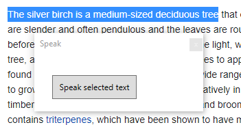

# Read Selected Text

Reads out loud the selected text.



## Usage

* Select some text
* Click the button

### Automated (no-ui)

Set the `GPII_ACTIVE_WINDOW` environment variable to the handle of the window which contains the selected text. The
selected text on the window will be read, and the application will terminate.

## How it works

The text is read from the window by copying it from clipboard (`CTRL` + `C` keypress is simulated).

However, by the time the button is clicked, the button's parent window is activated and the keypress is sent there.
To work around this, the active window is monitored and the keypress is sent to the last active window.

## Integration

Take [SelectionReader.cs](./ReadSelectedText/ReadSelectedTextApp/SelectionReader.cs), and use it like this:

Initialisation:

```cs
// Begin monitoring the active window.
WindowInteropHelper nativeWindow = new WindowInteropHelper(this);
HwndSource hwndSource = HwndSource.FromHwnd(nativeWindow.Handle);
SelectionReader selectionReader = new SelectionReader(nativeWindow.Handle);
hwndSource.AddHook(selectionReader.WindowProc);
```

Invocation:

```cs
// Get the selected text
string text = await selectionReader.GetSelectedText(activeWindow);
// Speak it
SpeechSynthesizer speech = new SpeechSynthesizer();
speech.SetOutputToDefaultAudioDevice();
speech.SpeakAsync(text);
```

### External process

If the application already knows the active window, set the `GPII_ACTIVE_WINDOW` to the window handle and start this
process.


